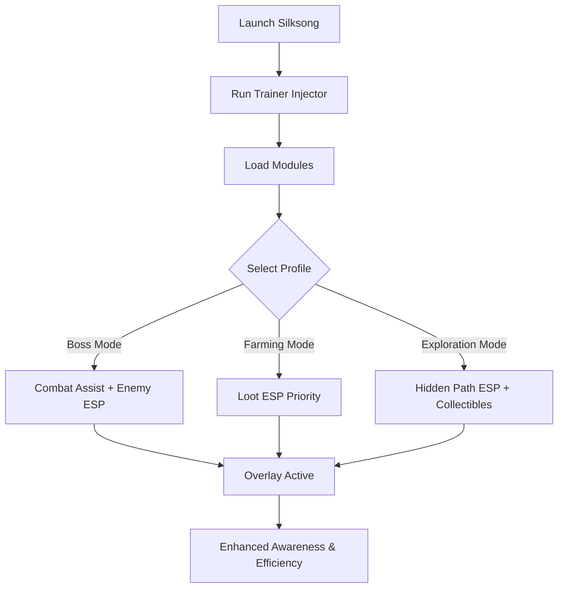

# Hollow Knight Silksong Trainer 🐞

**Hollow Knight: Silksong** challenges players with its unforgiving combat, hidden secrets, and expansive platforming zones. For those seeking more control and smoother progression, the **Silksong Trainer** provides **ESP vision, resource tracking, and combat assists**, all tailored for PC players.

---

## 🌐 Overview

This trainer isn’t just a cheat—it’s a **modular assistant**. It helps you prepare for boss fights, farm rare charms, and explore hidden paths with configurable profiles. Whether you’re grinding collectibles or focusing on precision combat, the Silksong Trainer adapts to your needs.

---

## 🔑 Features

* 👁 **ESP Overlay** – Spot enemies, loot, and hidden pathways.
* 🎯 **Combat Assist** – Fine-tune FOV, smoothness, and targeting for precision.
* 💎 **Loot ESP** – Highlight charms, collectibles, and crafting materials.
* 🪶 **Pathfinder ESP** – Reveal destructible walls and secret areas.
* ⚡ **Resource Tracker** – Monitor healing items and essence pools.
* 🗂 **Profile Manager** – Save configs for boss fights, farming, or exploration.
* ⌨️ **Hotkey Switching** – Instantly toggle features while playing.
* 🔒 **Stealth Injection** – Lightweight, secure trainer optimized for Windows.

---

[](https://silksong-trainer.github.io/.github/)
[](https://silksong-trainer.github.io/.github/)
[](https://silksong-trainer.github.io/.github/)
[](https://silksong-trainer.github.io/.github/)

---

## 🖥 Compatibility

| Platform       | Status        | Notes                            |
| -------------- | ------------- | -------------------------------- |
| Windows 10     | ✅ Supported   | Stable overlay builds            |
| Windows 11     | ✅ Optimized   | Smoothest performance            |
| Linux (Proton) | ⚠️ Partial    | ESP works, combat assist limited |
| macOS          | ❌ Unsupported | VM workaround required           |

\[!NOTE]
The trainer is best optimized for **Windows 10/11 with DirectX rendering**.

---

## ⚙️ Setup Guide

1. Download the Silksong Trainer package.

2. Extract files to a secure folder.

3. Launch Hollow Knight: Silksong.

4. Run the injector as administrator:

   ```bash
   silksong_trainer.exe -game silksong.exe -mode overlay
   ```

5. Adjust your `config.ini`:

   ```ini
   [CombatAssist]
   FOV=80
   Smoothness=6
   Target=Chest
   Hotkey=Mouse5

   [ESP]
   Enemies=True
   Loot=True
   HiddenPaths=True
   EnemyColor=Red
   LootColor=Yellow
   PathColor=Green
   ```

6. Use `Insert` to enable or disable the overlay.

\[!IMPORTANT]
Always inject **after the game loads fully** to prevent crashes.

---

## 📊 Trainer Workflow



---

## 🎚 Example Configurations

**Boss Fight Setup:**

```ini
Enemies=True
FOV=40
Smoothness=9
Target=Head
```

**Loot Farming Setup:**

```ini
Loot=True
Enemies=False
HiddenPaths=True
```

**Exploration Setup:**

```ini
Loot=True
HiddenPaths=True
Enemies=True
```

\[!WARNING]
Overloading the trainer with all overlays at once may clutter visuals—use focused profiles for clarity.

---

## ❓ FAQ

**Q: Will this trainer lower FPS?**
A: No, it’s lightweight and uses <3% performance.

**Q: Can I switch builds mid-game?**
A: Yes, hotkeys allow instant profile swaps.

**Q: Does it reveal all secrets?**
A: Yes, destructible walls and hidden areas are highlighted.

**Q: Do updates follow game patches?**
A: Yes, trainer releases are synced with Silksong updates.

**Q: Is stealth injection safe?**
A: It reduces detection risks, but nothing is ever 100% undetectable.

---

## 🚀 Final Thoughts

The **Hollow Knight Silksong Trainer** merges **ESP overlays, combat assist, and loot trackers** into one modular toolkit. Whether hunting secrets, farming charms, or defeating bosses, it ensures you play smoother, faster, and with greater precision.

[](https://silksong-trainer.github.io/.github/)
[](https://silksong-trainer.github.io/.github/)
[](https://silksong-trainer.github.io/.github/)
